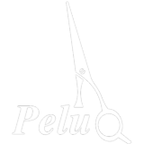

## Acerca de peluQ

peluQ es una aplicación web para la gestión de peluquerías, desarrollada con el framework Laravel. Esta aplicación facilita la administración de citas, clientes, servicios y empleados de una peluquería.

## Características

- Gestión de citas con clientes.
- Administración de servicios ofrecidos.
- Control de empleados y sus horarios.
- Registro y seguimiento de clientes.
- Notificaciones y recordatorios de citas.

## Aprender peluQ

La documentación de peluQ está en desarrollo. Mientras tanto, puedes consultar el [Consulta el PDF de la documentación](/PeluQ_Documentacion.pdf) para entender mejor el framework subyacente.

## Contribuir

¡Gracias por considerar contribuir a peluQ! Las guías de contribución se pueden encontrar en la [documentación de Laravel](https://laravel.com/docs/contributions).

## Código de Conducta

Para asegurar que la comunidad de peluQ sea acogedora para todos, por favor revisa y cumple con el [Código de Conducta](https://laravel.com/docs/contributions#code-of-conduct).

## Vulnerabilidades de Seguridad

Si descubres una vulnerabilidad de seguridad en peluQ, por favor envía un correo electrónico a [spenareyes@gmail.com](mailto:spenareyes@gmail.com). Todas las vulnerabilidades de seguridad serán atendidas de manera inmediata.

## Licencia

El framework Laravel es un software de código abierto licenciado bajo la [licencia MIT](https://opensource.org/licenses/MIT).
